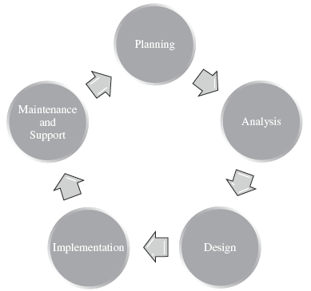

# RESUME
# INTRODUCTION
## CONTEXTE

La gestion de projets informatiques nécessite des méthodologies structurées pour organiser le développement et le déploiement de systèmes d'information. Le Systems Development Life Cycle (SDLC), située dans la phase "Execute and Control Project" du Project Life-Cyle (PLC), représente le cycle de vie produit le plus utilisé dans le domaine des technologies de l'information. Ce cycle établit une séquence logique d'activités de développement organisées en phases distinctes : la planification (planning), l'analyse (analysis), la conception (design), l'implémentation (implementation), et la maintenance et support (maintenance and support).

Chaque phase du SDLC présente des enjeux spécifiques. 

- La phase de planification se caractérise par sa forte dépendance aux livrables de la phase précédente du PLC et peut se décliner selon trois situations : une planification complète et imposée par le client (date, budget et fonctionnalités), une absence de planification préalable nécessitant une proposition complète du prestataire IT, ou une situation intermédiaire où seul le périmètre fonctionnel est défini. Cette phase distingue les projets feature-driven, typiquement internes avec flexibilité sur les délais, des projets date-driven, généralement externalisés avec flexibilité sur le périmètre fonctionnel.
- L'analyse englobe l'analyse du business, des utilisateurs, des technologies, des travaux antérieurs et de la faisabilité du projet. Cette phase produit la Software Requirements Specification (SRS), document décrivant le système logiciel à développer en détaillant les exigences fonctionnelles et non-fonctionnelles, pouvant inclure des cas d'utilisation, la définition des utilisateurs, des activités utilisateur et des contraintes métier. 
- La conception élabore l'architecture des différentes parties du système selon une approche hiérarchique de décomposition en composants et modules. Cette phase définit la conception système, les interfaces, les bases de données et fichiers, ainsi que la conception des programmes, en sélectionnant la pile technologique (technology stack) appropriée. Le résultat est une description formelle et une représentation du système complet consignée dans un document de spécification détaillé.
- L'implémentation concrétise cette architecture par le développement, l'intégration, les tests, l'installation du système, ainsi que la formation et la documentation nécessaires à son utilisation. 
- La phase de maintenance et support assure la pérennité du système en production, gérant les corrections d'erreurs, les améliorations fonctionnelles et l'adaptation aux évolutions de l'environnement organisationnel.

La maîtrise de ces phases et de leurs interdépendances constitue un facteur déterminant pour la gestion de projet IT, permettant d'assurer une progression ordonnée depuis l'identification d'un besoin jusqu'à la mise en production et le maintien opérationnel d'un système d'information.

## OBJECTIF DU RAPPORT 

Le déploiement constitue une activité critique de la phase d'implémentation du SDLC, consistant à mettre le système en production et à le rendre disponible aux utilisateurs finaux. L'intégration de l'IA générative dans le processus de déploiement peut offrir plusieurs avantages.
- **Automatisation de la création des fichiers de déploiement**: Beaucoup d'outils permettant de déployer des applications nécessitent la création de fichiers de configuration spécifiques (docker-compose.yml, Kubernetes YAML, etc.). L'IA générative peut automatiser la création de ces fichiers en fonction des spécifications du projet, réduisant ainsi le temps et les erreurs humaines.
- **Optimisation des processus de déploiement**: L'IA peut analyser les processus de déploiement existants et suggérer des améliorations pour les rendre plus efficaces, en identifiant les goulots d'étranglement et en proposant des stratégies d'optimisation.
- **Assistance à la résolution des problèmes**: Lors du déploiement, des problèmes techniques peuvent survenir. L'IA générative peut fournir une assistance en temps réel pour diagnostiquer et résoudre ces problèmes, en suggérant des solutions basées sur des bases de données de connaissances.
- **Automatisation de la documentation**: La documentation est essentielle pour le déploiement et la maintenance des systèmes. L'IA générative peut automatiser la création de documentation technique, facilitant ainsi la compréhension et l'utilisation du système par les équipes de développement et d'exploitation.

## PROBLEMATIQUE

Le déploiement est une étape dans le SDLC qui peut être complexe et où plusieurs défis peuvent compromettre la mise en production. 
- **Complexité des environnements hétérogènes**: Les systèmes sont souvent déployés sur des infrastructures variées (cloud multi-fournisseurs, hybride) avec des configurations et contraintes différentes, augmentant le risque d'incompatibilités et d'erreurs. L'IA générative peut analyser automatiquement les caractéristiques de chaque environnement cible et générer des scripts ou fichiers de déploiement adaptés, incluant la détection et la résolution de conflits de dépendances.
- **Gestion des fichiers de configuration**: La création et la gestion des fichiers de configuration peut être fastidieuses, chronophages et sujettes aux erreurs. L'IA générative peut automatiser la génération de ces fichiers en fonction des besoins spécifiques de chaque environnement, assurant ainsi une cohérence et une réduction des erreurs humaines.
- **Gestion des dépendances et des versions**: Les systèmes modernes comportent de nombreuses dépendances (bibliothèques, frameworks, services externes) dont les incompatibilités de versions peuvent provoquer des échecs de déploiement difficiles à diagnostiquer. L'IA générative peut aider à identifier les dépendances nécessaires, à gérer les versions compatibles et à générer des scripts d'installation automatisés.
- **Gestion des erreurs**: Le déploiement peut échouer pour diverses raisons, et la détection rapide des erreurs est cruciale. L'IA générative peut analyser les logs de déploiement en temps réel, identifier les erreurs potentielles et proposer des solutions correctives basées sur des modèles d'apprentissage automatique.
- **Interruption de service**: Le déploiement nécessite souvent des interruptions de service impactant la disponibilité du système, particulièrement critique pour les systèmes en production 24/7. L'IA générative peut concevoir des stratégies de déploiement intelligentes (blue-green deployment, rolling updates) optimisant la séquence des opérations pour minimiser l'indisponibilité.

# METHODOLOGIE	
## APPROCHE PEDAGOGIQUE 
## OUTILS ET TECHNOLOGIES UTILISES 
## PARTICIPANTS 
## COLLECTE DE DONNEES 
## CRITERES D’EVALUATION 
# REFERENCES	
# RESULTATS ET ANALYSES
## PHASE DE DEPLOIEMENT
## SYNTHESE DES RESULTATS 
# DISCUSSION	
## BENEFICES OBSERVES 
## DEFIS RENCONTRES 
## RETOUR D’EXPERIENCE DU GROUPE 
## COMPARAISON AVEC D'AUTRES APPROCHES OU PRATIQUES 
# CONCLUSION	
# RECOMMANDATIONS	
# REFERENCES	

- [https://content.startuplandia.io/thoughts/software-development-lifecycle/](https://content.startuplandia.io/thoughts/software-development-lifecycle/)

# ANNEXES	
